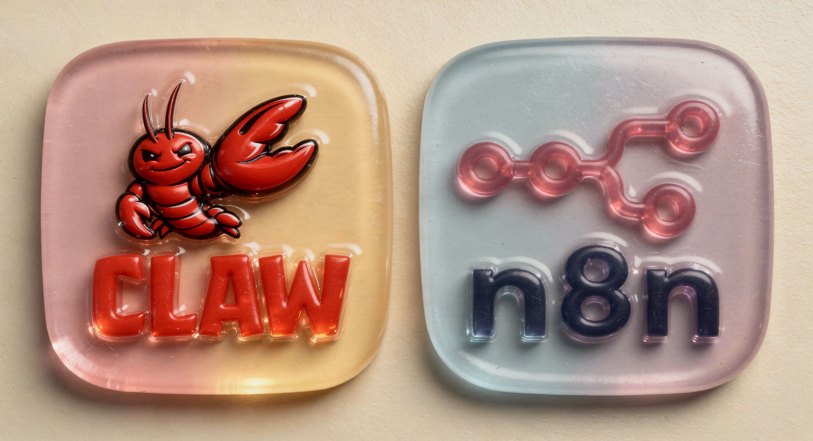

# N8nOps - Autonomous n8n Workflow Automation Agent

<p align="center">
  
</p>

An expert-level AI agent that lives inside your n8n instance, capable of creating, debugging, testing, monitoring, and optimizing workflows via the n8n REST API. Built on the [OpenClaw](https://github.com/openclaw) agent framework.

## What It Does

N8nOps acts as your personal automation architect. Instead of manually building workflows in the n8n UI, you describe what you need in plain language, and the agent handles the rest:

- **Create workflows** from natural language descriptions
- **Debug & fix** failed executions by tracing errors to specific nodes
- **Monitor health** with automatic heartbeat checks every 30 minutes
- **Manage credentials** and guide setup when needed
- **Build AI pipelines** with LangChain integration (RAG, agents, tools, memory)
- **Optimize** existing workflows for performance and reliability

## Tech Stack

| Component | Technology |
|-----------|-----------|
| Primary LLM | Anthropic Claude Sonnet 4 |
| Fallback LLM | OpenAI GPT-4o |
| Target Platform | n8n 2.0.0 |
| Agent Framework | OpenClaw |
| Communication | REST API via curl |

## Project Structure

```
openclaw-n8n-agent/
├── openclaw.json          # Agent configuration
├── SOUL.md                # Core identity & n8n expertise
├── IDENTITY.md            # Personality definition
├── AGENTS.md              # Workspace protocols
├── TOOLS.md               # n8n connection details & API patterns
├── BOOTSTRAP.md           # First-run setup guide
├── MEMORY.md              # Long-term memory
├── HEARTBEAT.md           # Health monitoring protocol
├── USER.md                # User profile
├── memory/                # Session-based memory files
└── skills/n8n/            # Expertise modules
    ├── SKILL.md            # n8n mastery overview
    ├── node-catalog.md     # 65+ verified node types
    ├── ai-patterns.md      # AI workflow connection patterns
    ├── api-reference.md    # n8n REST API endpoints
    └── templates.md        # Ready-to-use workflow templates
```

## Features

### Workflow Lifecycle Management
- Create, edit, activate/deactivate, and delete workflows
- Validate workflow JSON before deployment
- Show diffs when updating workflows for human review

### Execution Monitoring
- List and filter executions by status, workflow, or date range
- Diagnose failed executions and identify root causes
- Retry failed workflows and clean up old logs

### AI/LangChain Integration
- Build AI agent pipelines with tool use
- Configure LLM models (OpenAI, Anthropic, Ollama, Google Gemini)
- Set up conversational memory (Buffer Window, Redis, Postgres)
- Implement RAG workflows with vector store integration
- Supported vector stores: Pinecone, Postgres, Qdrant, In-Memory

### Health Monitoring
- Automatic heartbeat checks every 30 minutes
- Alerts on failed executions and critical workflow failures
- Tracks active workflow count and instance health

## Getting Started

### Prerequisites

- n8n instance running (default: `http://localhost:5678`)
- n8n version 2.0.0
- n8n API key

### Setup

1. **Verify n8n is accessible:**
   ```bash
   curl -s -o /dev/null -w "%{http_code}" http://localhost:5678/healthz
   # Expected: 200
   ```

2. **Create an API key** in n8n UI:
   - Go to Settings > API > Create API Key

3. **Test the API key:**
   ```bash
   curl -s -H "X-N8N-API-KEY: YOUR_KEY" http://localhost:5678/api/v1/workflows
   ```

4. **Set environment variable:**
   ```bash
   export N8N_API_KEY=YOUR_API_KEY
   ```

5. **Run bootstrap** to inventory workflows and credentials on first launch.

## Configuring n8n for OpenClaw

### 1. Install & Run n8n

You need a running n8n 2.0.0 instance. You can set it up with Docker or npm:

**Docker (recommended):**
```bash
docker run -it --rm \
  --name n8n \
  -p 5678:5678 \
  -v n8n_data:/home/node/.n8n \
  n8nio/n8n:2.0.0
```

**npm:**
```bash
npx n8n@2.0.0
```

n8n will be available at `http://localhost:5678`.

### 2. Enable the n8n API

1. Open `http://localhost:5678` in your browser
2. Complete the initial setup (create owner account)
3. Go to **Settings > API**
4. Click **Create API Key**
5. Copy the generated key

### 3. Configure OpenClaw Connection

Edit `openclaw.json` to point to your n8n instance:

```json
{
  "agent": {
    "model": "anthropic/claude-sonnet-4-20250514",
    "fallbackModel": "openai/gpt-4o",
    "workspace": "./",
    "thinkingDefault": "high",
    "timeoutSeconds": 600,
    "heartbeat": {
      "every": "30m"
    }
  },
  "tools": {
    "exec": { "enabled": true, "policy": "standard" },
    "web_fetch": { "enabled": true },
    "web_search": { "enabled": true },
    "browser": { "enabled": true },
    "apply_patch": { "enabled": true },
    "diffs": { "enabled": true }
  },
  "env": {
    "N8N_BASE_URL": "http://localhost:5678",
    "N8N_API_BASE": "http://localhost:5678/api/v1"
  }
}
```

If your n8n runs on a different host/port, update the `env.N8N_BASE_URL` and `env.N8N_API_BASE` values accordingly.

### 4. Set Your API Key

Export the n8n API key as an environment variable:

```bash
export N8N_API_KEY=your-api-key-here
```

### 5. Verify the Connection

```bash
curl -s -H "X-N8N-API-KEY: $N8N_API_KEY" http://localhost:5678/api/v1/workflows
```

If you get a JSON response with workflow data (or an empty `data` array), the connection is working.

### 6. Bootstrap the Agent

On first run, the agent will:
1. Verify n8n instance accessibility
2. Inventory all existing workflows and credentials
3. Populate `MEMORY.md` with the workflow catalog
4. Update `TOOLS.md` with credential inventory
5. Load skill files from `skills/n8n/` for node types, AI patterns, and templates

After bootstrap completes, the agent is ready to build, debug, and manage workflows.

### Key Configuration Options

| Option | Default | Description |
|--------|---------|-------------|
| `agent.model` | `anthropic/claude-sonnet-4-20250514` | Primary LLM for reasoning |
| `agent.fallbackModel` | `openai/gpt-4o` | Fallback when primary is unavailable |
| `agent.thinkingDefault` | `high` | Reasoning depth (high = deep analysis) |
| `agent.timeoutSeconds` | `600` | Max seconds per operation |
| `agent.heartbeat.every` | `30m` | Health check interval |
| `session.reset.idleMinutes` | `10080` | Session reset after 7 days idle |
| `env.N8N_BASE_URL` | `http://localhost:5678` | n8n instance URL |
| `env.N8N_API_BASE` | `http://localhost:5678/api/v1` | n8n API endpoint |

### n8n API Endpoints Used

The agent communicates with n8n through these REST API endpoints:

| Method | Endpoint | Purpose |
|--------|----------|---------|
| `GET` | `/api/v1/workflows` | List all workflows |
| `POST` | `/api/v1/workflows` | Create a new workflow |
| `GET` | `/api/v1/workflows/:id` | Get workflow details |
| `PUT` | `/api/v1/workflows/:id` | Update a workflow |
| `DELETE` | `/api/v1/workflows/:id` | Delete a workflow |
| `POST` | `/api/v1/workflows/:id/activate` | Activate a workflow |
| `POST` | `/api/v1/workflows/:id/deactivate` | Deactivate a workflow |
| `POST` | `/api/v1/workflows/:id/run` | Trigger execution |
| `GET` | `/api/v1/executions` | List executions |
| `GET` | `/api/v1/executions/:id` | Get execution details |
| `GET` | `/api/v1/credentials` | List credentials |

All API calls require the `X-N8N-API-KEY` header for authentication.

## Safety

- Confirms before activating/deactivating production workflows
- Confirms before deleting workflows
- Never hardcodes API keys or secrets
- Always reads current state before modifying (GET before PUT)
- Shows diffs for all workflow updates

## Author

**Saman Salari** - Developer, Product Designer & AI Enthusiast

Based in the UK, focused on AI engineering to create smart, impactful digital experiences. 10+ years of experience building scalable web applications and automation systems using React, Next.js, Node.js, and AI-powered development tools.

- **Website:** [samansalari.com](https://www.samansalari.com)
- **LinkedIn:** [linkedin.com/in/samansalari](https://www.linkedin.com/in/samansalari/)
- **X:** [x.com/samansalari](https://x.com/samansalari/)
- **Email:** me@samansalari.com

## License

This project is open source. See [LICENSE](LICENSE) for details.
